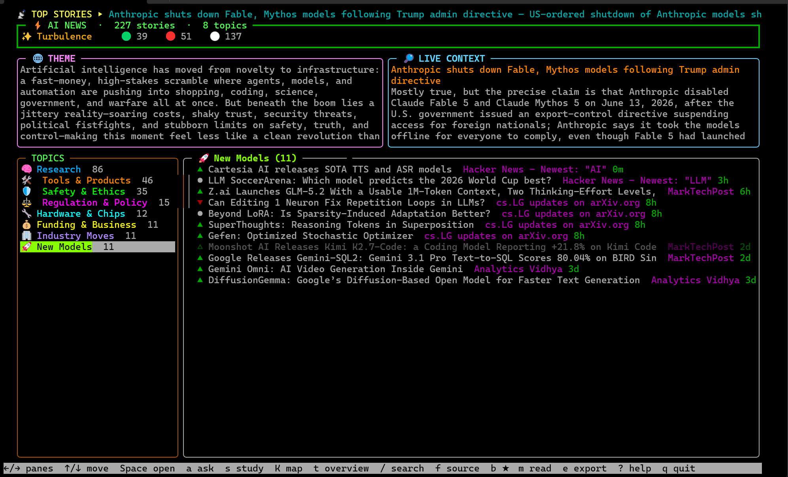

# ai_news_feed



A colorful, geometric curses TUI for AI news. Pulls ~40 AI/ML RSS feeds in parallel,
enriches them with **GPT-5.4** via the OpenAI **Responses API**, and presents
everything as a stacked composite: a scrolling **marquee** of the day's most
important story, the ⚡ **banner** (counts + one-word mood + sentiment mix),
side-by-side 🌐 **THEME** and 🔎 **LIVE CONTEXT** panels, and a **two-pane
browser** — topic clusters on the left, that topic's stories on the right —
where Space/Enter opens a framed **story page**.

It goes beyond reading: a **multi-turn chat** answers questions over the whole
day or a single story, and a **deliberate-practice layer** — a **Socratic tutor**
that grades your explanations (adaptive difficulty + spaced review) over a
**concept knowledge-graph** of ~175 cognitive-architecture + ML topics — turns
the feed into a path toward master-level understanding.

## Quick start (no global install)

```bash
git clone https://github.com/gmiv/ainews && cd ainews
./run            # first launch builds an isolated .venv, installs deps, then runs
```

`./run` (and `python ai_news_feed.py`) create an **isolated virtualenv**, install
everything into it, and run inside it — your global / system Python is never
touched. On WSL the venv is placed on the Linux filesystem (`~/.cache/ainews/…`,
not the slow Windows drive); on native Linux/macOS it's a local `.venv`.
Useful: `./run --setup` (build only), `make test`, `python ai_news_feed.py --clean`
(remove the venv). Prefer a global command? Use the pipx install below.

## Install

```bash
pipx install "ainews[all]"   # standalone command on your PATH (full experience)
ainews                       # launch
```

`[all]` pulls the optional `openai` + `trafilatura` reader stack; a bare
`pipx install ainews` still runs (raw feed, no GPT enrichment / reader).

### From source

```bash
git clone https://github.com/gmiv/ainews && cd ainews
pip install -e ".[all]"
ainews                       # or:  python -m ainews  /  python ai_news_feed.py
```

## Configure

Set your OpenAI key for the GPT-5.4 enrichment (falls back to `OPENAI_API_KEY`):

```bash
export OPENAI_API_KEY_UTILS="sk-..."
```

A cold run makes ~11 cached LLM calls (theme, one-word, batched classification,
a 3-vote importance judge, and one `web_search` grounding); chat and the
Socratic tutor are on-demand — one call per question / graded answer. **No key?
It still runs** — you get the raw, de-duplicated feed, and the knowledge map
still tracks the concepts each story touches; only the GPT enrichment, chat, and
tutor need a key. Everything tunable lives in
[`ainews/config.py`](ainews/config.py).

## What it does

| Stage | Detail |
|-------|--------|
| **Parallel fetch** | ~40 AI/ML feeds fetched concurrently (thread pool) with a per-feed timeout + per-feed entry cap; dead feeds are skipped, not fatal. |
| **Disk cache** | Feeds cached 30 min, LLM output 6 h (`~/.cache/ai_news_feed`) — relaunches are instant and don't re-bill. |
| **Loading spinner** | Live progress on every slow phase instead of a silent freeze. |
| **De-dup** | Exact + fuzzy-title de-duplication (`difflib`) collapses the same story across sources. |
| **Theme summary** | One-paragraph "atmosphere" read of the day's headlines. |
| **One-word mood** | A single distilled word for the overall trend. |
| **Classify everything** | Every headline gets a GPT-5.4 sentiment + topic label (batched), so there's no giant "General" bucket. |
| **Color + emoji intelligence** | Each topic cluster gets its own color + emoji; every row carries a colored gutter, a topic chip, and a sentiment glyph (▲ hype / ▼ concern / ● neutral, hollow when read). |
| **TOPIC MIX dashboard** | A heavy-boxed, block-bar chart (`█▉▌`) of the day's topic distribution with rank badges + emoji. |
| **Top-5 leaderboard marquee** | A scrolling ticker that cycles the day's top-5 most important stories (with `①②③` rank badges), chosen by a hybrid score — theme-centrality + cross-source corroboration + recency + source authority — with the #1 re-ranked by a shuffled, majority-vote GPT-5.4 judge. The full ranked list also appears in the `t` overview. |
| **Live grounding** | The #1 story is fact-checked/expanded with GPT-5.4's built-in `web_search` tool, with real clickable citations. |
| **Chat with your feed** | `a` opens a **multi-turn** Q&A overlay — ask anything about today's news; answered over the curated, classified day by **gpt-5.4-mini** with live web search + citations (markdown, scrollable). Follow-ups (`a`/`/`) carry the **conversation history** so the model stays in context; the whole thread accumulates on screen, and `x` clears it to free tokens. |
| **Ask about *this* story** | Inside the story page, `a` opens the *same* multi-turn Q&A overlay but **scoped to the one story** — grounded in its summary and the scraped full-article text (auto-fetched, cached), plus live web search to fill gaps. The feed-level `a` answers across all stories; this one stays on the story in front of you. |
| **In-app reader** | In the story page, `r` scrapes the full article (via `trafilatura`, as **markdown**) and renders it **colorfully** — headings, **bold**, *italic*, `code`, links, blockquotes, lists — inline & scrollable; `o`/Enter opens it in your real browser — WSL-aware (`explorer.exe`/`wslview`/PowerShell), so links actually open under WSL. |
| **Socratic tutor (mastery)** | `s` turns the selected story into deliberate practice: it picks the weakest concept the story touches, asks you to **explain it**, then **grades** your answer (score · what you nailed · misconceptions · a model answer · a deeper follow-up). Each grade updates your per-concept *understanding* and reschedules review. Difficulty is **adaptive** — it tracks your level per concept and pushes from foundations → trade-offs → frontier synthesis. |
| **Knowledge map (mastery)** | `K` shows your **concept knowledge-graph** — ~175 cog-arch + ML concepts across 8 categories, each marked unseen ○ / encountered ◔ / reviewing ◑ / mastered ●, with coverage bars, gaps, and what's ⏰ due for review. Stories are auto-tagged onto it as you read. Progress persists in `~/.cache/ai_news_feed/mastery.json`. |
| **Power tools** | In-app fuzzy search, source filter, bookmarks + read/unread (persisted across runs), and one-key Markdown digest export. |

The whole renderer is **display-width aware** ([`textwidth.py`](textwidth.py)) so
double-width emoji and box glyphs stay aligned, and the loop animates the marquee
on a timer (and rebuilds on terminal resize).

## Keys (in the TUI)

| Key | Action |
|-----|--------|
| `←/→` `h/l` · `Tab` | move focus between TOPICS and STORIES |
| `↑/↓` `j/k` · `PgUp/PgDn` · `g/G` | move within the focused pane |
| `Space` / `Enter` | open the story page → `o`/`Enter` browser · `r` read full article · `a` ask about **this** story · `↑/↓` scroll · `b` ★ · `←`/`Esc` back |
| `t` | overview: full theme / live context / top-5 leaderboard / topic-mix |
| `s` | **Socratic study** on the selected story — explain a concept, get graded; adaptive difficulty + spaced review |
| `K` | **knowledge map** — concept coverage (unseen→mastered), gaps, and what's due to review |
| `a` | chat with your feed — ask across **all** stories; multi-turn (`a`/`/` follow-up · `x` clear history · `Esc` close). Inside a story page, `a` instead asks about just **that** story |
| `/` | fuzzy search (Enter apply, Esc cancel) |
| `f` | filter by source (picker) |
| `b` / `B` | bookmark selected story · show bookmarks only |
| `m` / `u` | mark read/unread · show unread only |
| `e` | export the day's digest to Markdown |
| `c` / `Esc` | clear all filters & search |
| `?` | help overlay |
| `q` | quit (bookmarks + read-state are saved) |

The focused pane has a highlighted border. The header (marquee / banner /
panels) drops gracefully on short terminals so the browser keeps room.
Bookmarks and read-state persist in `~/.cache/ai_news_feed/state.json`; digests
are written to the current directory.

## Configuration

Everything tunable lives in [`config.py`](config.py): the feed list, model id,
per-task reasoning effort / verbosity / token caps, feature flags
(`ENABLE_SENTIMENT`, `ENABLE_CLUSTERING`, `ENABLE_GROUNDING`, …), lookback
window, cache TTLs, and fetch concurrency.

## Architecture

A single `Article` dataclass ([`models.py`](models.py)) is the lingua franca.
Modules are small and single-purpose:

```
config.py         tunables + API-key resolution
models.py         Article dataclass (+ to_dict/from_dict, cluster_size)
cache.py          JSON file cache with per-entry TTL
colors.py         curses color-pair IDs + dynamic topic palette
glyphs.py         geometry + emoji kit (boxes, bars, badges, topic/sentiment glyphs)
textwidth.py      display-width helper (emoji/wide-glyph aware) for alignment
feeds.py          parallel fetch · date filter · fuzzy de-dup (+ corroboration)
analysis.py       pure stats (source counts, top words)
llm.py            defensive Responses-API client (param degradation)
enrich.py         theme / one-word / classify / grounding / chat / Socratic grading
mastery.py        deliberate-practice core: concept graph state, adaptive difficulty, spaced review
concepts_seed.py  the ~175-concept cog-arch + ML knowledge-graph taxonomy (reference data)
markdown_render.py  rich markdown → colorful color segments
wrapping.py       word wrapping of render lines (width-aware)
importance.py     pick + rank the day's top stories (hybrid score + LLM judge)
state.py          FeedState controller: topic axis / groups / search / filter / bookmarks / leaderboard
persist.py        JSON store for bookmarks + read-state
export.py         Markdown digest writer
ui.py             two-pane curses browser (panes, story page, chat, overview, Socratic tutor, knowledge map)
openurl.py        WSL-aware "open in browser" (explorer.exe / wslview / …)
reader.py         in-app article scraper (trafilatura → bs4 → stdlib fallback)
loading.py        TTY-aware spinner
app.py            orchestration (fetch → enrich → importance → build state → render)
```

The LLM client is deliberately defensive: gpt-5.x parameter names drift between
versions, so any rejected optional parameter (`reasoning`, `text`/`verbosity`,
`max_output_tokens`, `tools`, `include`) is dropped and the call retried — the
app can't hard-fail on an API surface change.
